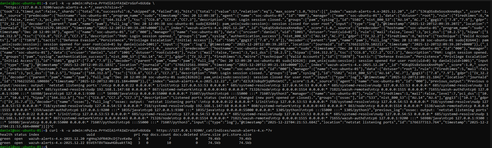

# Cybersecurity Home Lab - Ubuntu Server & Wazuh SIEM

## Overview

This project documents the design, deployment, and validation of a personal cybersecurity home lab built to simulate a small-scale Security Operations Center (SOC). The lab focuses on Linux server administration, system hardening, and security monitoring using a SIEM platform.

The primary goal of this lab is to gain hands-on experience with log collection, alerting, and troubleshooting in a controlled virtualized environment while applying cybersecurity best practices.

## Objectives

- Deploy and configure a secure Linux server environment  
- Install and validate a SIEM solution for log monitoring  
- Practice system hardening and service management  
- Gain experience troubleshooting authentication and service issues  
- Document the environment in a professional, reproducible format  

## Lab Architecture

The homelab is hosted on a virtualized environment and consists of a single Ubuntu Server virtual machine acting as the SIEM server.

### Architecture Summary
- Host machine running a hypervisor  
- Ubuntu Server virtual machine  
- Wazuh Manager, Indexer, and Dashboard running on the VM  
- Local log generation for testing and validation  

*(Architecture diagram will be added in the `diagrams/` directory.)*

## Hardware & Software Stack

### Hardware
- Host Machine: Mini PC/Desktop  
- CPU: AMD Ryzen series  
- Memory: 32 GB RAM  
- Storage: NVMe SSD 1 TB
- Network: Home LAN (NAT/Bridged)  

### Virtualization
- Hypervisor: Proxmox VE  
- Virtual Machine: Ubuntu Server  

### Operating System
- Ubuntu Server 24.04 LTS  

### Security & Monitoring Tools
- Wazuh SIEM  
  - Wazuh Manager  
  - Wazuh Indexer (OpenSearch)  
  - Wazuh Dashboard  
- Filebeat  
- OpenSearch Security Plugin

## Network Configuration

- Ubuntu Server configured with a static IP address  
- Static IP ensures consistent access to:
  - Wazuh Dashboard  
  - Wazuh API  
  - OpenSearch services  
- Network configuration verified using `ip a` and connectivity testing  

**Reasoning:**  
A static IP is critical in security monitoring environments to prevent service disruption and simplify management and access control.

## System Hardening & Security Controls

The Ubuntu Server VM was hardened following Linux security best practices:

- Disabled root SSH login  
- Used non-root user with `sudo` privileges  
- Verified service permissions and ownership  
- Enabled only required services  
- Managed services using `systemctl`  
- Validated listening ports and running services  

## SIEM Deployment & Validation

### Wazuh Installation
- Installed Wazuh Manager, Indexer, and Dashboard  
- Configured services to start automatically  
- Verified installation integrity  

### Service Verification
systemctl status wazuh-manager
systemctl status wazuh-indexer
systemctl status wazuh-dashboard

All services were confirmed running successfully.

### Log Ingestion & Alerts
- Confirmed Wazuh indices were created  
- Verified alert ingestion using OpenSearch `_cat/indices`  
- Successfully accessed the Wazuh Dashboard  
- Generated and observed test alerts  

### OpenSearch Indices showing Wazuh alert data

## Troubleshooting & Lessons Learned

During deployment, authentication issues were encountered when accessing the Wazuh API and OpenSearch services.

### Issues Encountered
- Unauthorized API responses  
- Role and permission misconfiguration in OpenSearch  

### Resolution
- Corrected OpenSearch security role mappings  
- Verified user credentials and permissions  
- Restarted affected services to apply changes  

**Key Takeaway:**  
Security tooling often fails silently due to permission or role misconfigurations. Understanding service dependencies and logs is critical for effective troubleshooting.

## Skills Demonstrated

- Linux Server Administration  
- Virtualization & VM Management  
- SIEM Deployment and Validation  
- Log Monitoring and Analysis  
- Network Configuration  
- Security Hardening  
- Troubleshooting Authentication Issues  
- Technical Documentation  

## Future Improvements

Planned enhancements include:
- Adding endpoint agents on additional VMs  
- Integrating intrusion detection  
- Centralizing logs from multiple systems  
- Simulating attack scenarios for detection testing  
- Implementing role-based access controls  

## 👤 Author
**Daniel Lopez**  
Computer Systems Engineering (Cybersecurity)  
Arizona State University  
Expected Graduation: May 2026  
